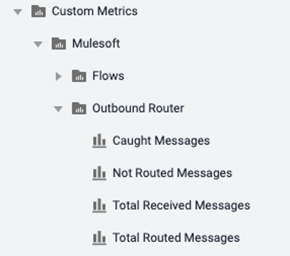
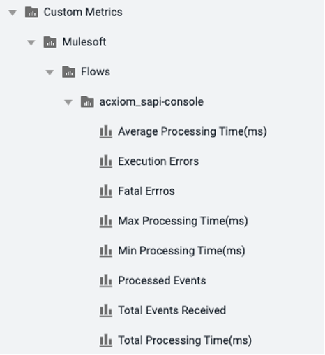
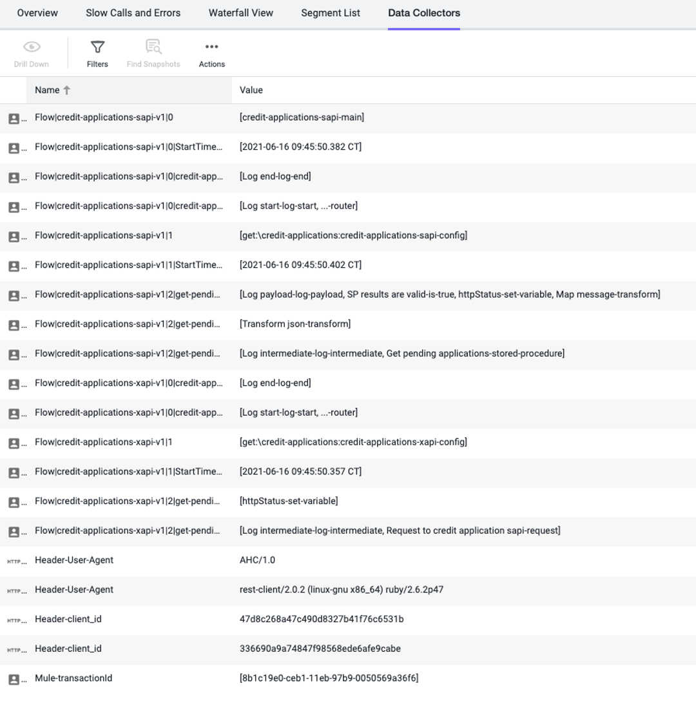
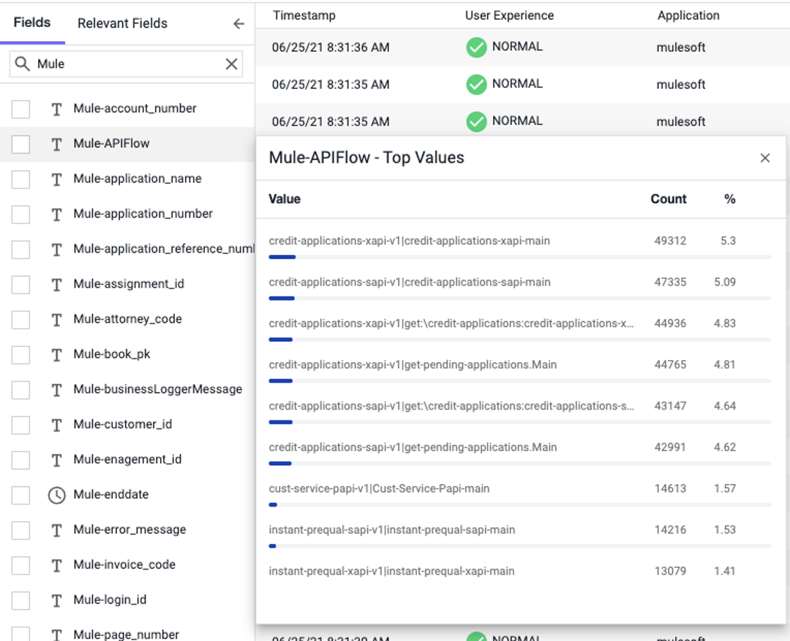
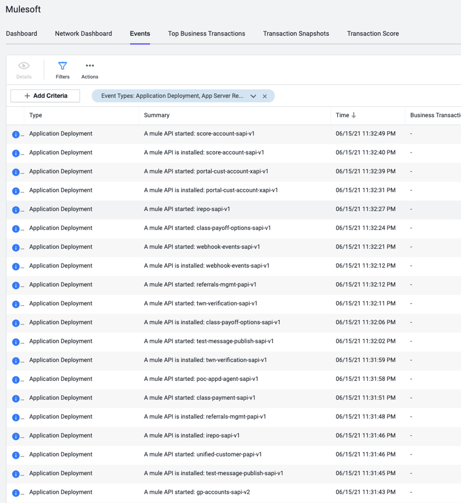
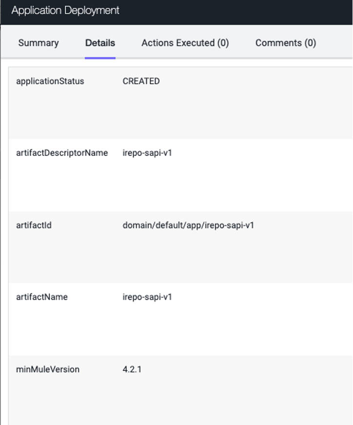

## Motivation for a Mulesoft Plugin

Though Mule is supported by appdynamics, the display of BTs and backends does not often display the design of Mulesoft flows and steps in the way administrators and developers work within mulesoft. This plugin takes advantage of the mulesoft notification framework to add decorations to transactions within mulesoft in order to help a user troubleshooting issues map what they know of the transactions to information made available within appdynamics.

The following capabilities are added with the mulesoft agent plugin:
- Custom Metrics of Mulesoft Analytics for Flows and Routers
- Custom Data within Snapshots to show flow and step execution
- Custom Data within Analytics to allow for queries on Mule Flow statistics
- Custom Events within the application to show Mulesoft Application install/start/stop/failure events
- An entry point is available for future extension in case a mule connector does not correlate OOTB in appdynamics

### Custom Metrics

Custom Metrics are published from Mulesoft's internal analytics collection mechanism, directly into the controller as node level custom metrics




### Custom Data

An example of the Custom Data collected in Snapshots



An example of the Custom Data collected in Analytics



### Custom Events

An example of the Custom Events reported to the Application



Details of one Custom Event



## Installation Instructions

### Required
- Agent version 21.4+
- Mulesoft version 4.3.0+
- Java 8+


### Deployment steps
- Copy `AppD-MuleAgentTracer-<version>.jar` file under `<agent-install-dir>/ver.x.x.x.x/sdk-plugins`
- OPTIONALLY: add the following config options as well to the `wrapper.conf`
```properties
  wrapper.java.additional.92=-DAppDynamicsForceMulesoftStatisticsCollection=false
  wrapper.java.additional.93=-DAppDynamicsFlattenNameMulesoftStatisticsCollection=false
```
- Restart the mule JVM
- Edit `MuleMetricCollection.properties` file in `<agent-install-dir>/ver.x.x.x.x/sdk-plugins`
  to use the flow statistics white list and black list properties. Some organizations have thousands of flows
  and will not want to monitor all of them, this feature may or may not be needed for your deployment
 ```properties
  com.appdynamics.mulesoft.agent.metric.blackListRegex=regex test # to skip collection on match
  com.appdynamics.mulesoft.agent.metric.whiteListRegex=regex test # to collect on match else skip (applied after blacklist)
```

Flow data may come back in ways that are not intuitive to the developers creating flows and subflows. A review of this reference
may help before considering something a "bug" https://docs.mulesoft.com/mule-runtime/4.3/about-flows

If errors in the agent log file resembling these lines:
```
[appdynamics-analytics-autodata-writer1] 11 May 2024 13:20:34,039  WARN AnalyticsAutoDataTransform - Enqueuing transformed CollectionData failed since publish queue is full. This operation has failed [18000] time(s).
[appdynamics-analytics-autodata-writer1] 11 May 2024 13:20:34,040  WARN AnalyticsAutoDataTransform - Enqueuing transformed CollectionData failed since publish queue is full. This operation has failed [18100] time(s).
[appdynamics-analytics-autodata-writer1] 11 May 2024 13:20:54,198  WARN AnalyticsAutoDataTransform - Enqueuing transformed CollectionData failed since publish queue is full. This operation has failed [18200] time(s).
[appdynamics-analytics-autodata-writer1] 11 May 2024 13:25:15,542  WARN AnalyticsAutoDataTransform - Enqueuing transformed CollectionData failed since publish queue is full. This operation has failed [18300] time(s).
[appdynamics-analytics-autodata-writer1] 11 May 2024 13:26:54,198  WARN AnalyticsAutoDataTransform - Enqueuing transformed CollectionData failed since publish queue is full. This operation has failed [18400] time(s).
```
add this node property to mulesoft nodes: `max-analytics-collectors-allowed=5000` (2000 is default, but that isn't enough in large environments)
